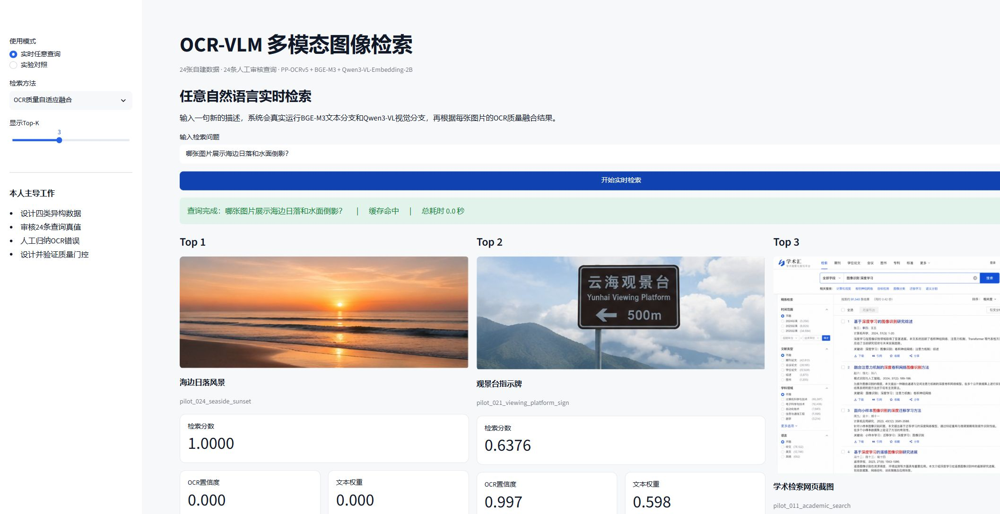

# OCR-VLM 多模态个人资料库

面向通用个人图片与文档的本地多模态检索原型：将图片、ZIP、PDF、DOCX和PPTX统一转换为页面，结合OCR文本、视觉语言向量、OCR质量门控与视觉语言重排，完成自然语言到资料页面的检索。项目强调本地隐私、分库隔离、证据溯源和人工质量裁决，不依赖商业大模型API。

## 最新独立评测

V16 使用与历史目标零重叠、路线均衡的 50 条校准查询选择配置，并在锁定配置后首次运行另一组 50 条独立留出查询。留出结果没有用于回改 V16：

| 指标 | 结果 |
|---|---:|
| 可回答查询 Recall@1 / Recall@10 | 86.67% / 96.67% |
| 可回答接收率 | 100.00% |
| 无答案拒绝率 | 95.00% |
| 端到端 Top-1 | 90.00% |
| 热缓存 P95 | 1.261 秒 |

标签由 AI 根据公开来源与 OCR 核验，不是人工金标准。完整的数据隔离、失败样例和配置指纹见 `records/experiments/retrieval_v16_independent_holdout_2026-08-07.md`；锁定配置以原始 SHA-256 保存在 `config/selected_retrieval_config_v16.json`。

## 当前状态

- [x] PP-OCRv5单图与manifest批量推理
- [x] 24张异构图片OCR基线：24/24无程序异常
- [x] OCR文字切块：20张有文字图片，共38个片段
- [x] BGE-M3 + FAISS文本语义检索
- [x] 中英文混合分词BM25稀疏检索
- [x] 人工审核24条查询真值与正式Recall@K评测
- [x] Qwen3-VL-Embedding-2B视觉大模型语义分支
- [x] OCR质量感知的多模态融合
- [x] Streamlit可视化实验结果浏览器
- [x] 任意自然语言实时检索与查询缓存
- [x] 图片、ZIP、PDF、DOCX、PPTX批量导入与页面级溯源
- [x] 批量OCR并更新Dense、BM25和视觉索引
- [x] Qwen3-VL-Reranker-2B候选重排
- [x] Dense + BM25 + Image三路召回、RRF消融与查询感知校准
- [x] 建立1500页异构公开资料库
- [x] 内容哈希去重、感知近重复分组和隐私复核标记
- [x] 多资料库严格隔离：独立原图、OCR、BM25和双路向量索引
- [x] 新数据AI生成内容人工声明不超过5%
- [x] 1500页批量OCR、Dense/BM25文本索引和视觉索引
- [x] 质量中心将541个类别或质量风险页面路由给人工审核
- [x] 隔离18张同底图变体，当前1482页参与检索
- [x] 清空旧人工类别与查询裁决，支持从零重新标注和再次训练反馈分类器
- [x] 将类别审核按关联组冻结为训练351页、验证95页、测试95页
- [x] 完成601条人工类别/质量裁决与三轮主动学习
- [x] 冻结“规则 + 0.80高置信模型纠错”，最终测试Accuracy 0.8632
- [x] 三路索引物理压缩至1482个有效页面，失效重复页不再占用召回空间
- [x] 类别体系升级为7个主内容类别与11项独立质量标签
- [x] 检索结果展示主导分支、分支分数、OCR字面命中与来源证据
- [x] 视觉描述查询自动路由，并在原始相似度不足时拒绝返回伪匹配
- [x] 独立盲测工作台：自然查询无结果采集、冻结指纹、多路候选池与人工qrels
- [x] 导入阶段状态、来源证据、查询缓存和标准化自动测试

当前24张`dataset_v1`结果：

| 方法 | Recall@1 | Recall@3 | MRR |
|---|---:|---:|---:|
| OCR文本 | 0.7083 | 0.7917 | 0.7490 |
| Qwen3-VL视觉 | 0.9167 | 0.9583 | 0.9435 |
| 固定融合 | 0.7917 | 0.7917 | 0.8090 |
| OCR质量自适应融合 | **0.9583** | **0.9583** | **0.9643** |
| BM25 | 0.7500 | 0.7917 | 0.7841 |
| Dense + BM25 + Image等权RRF | 0.7500 | 0.7917 | 0.7908 |
| 查询感知三路混合 | **0.9583** | **1.0000** | **0.9722** |
| 查询感知三路混合 + Qwen3-VL重排 | **1.0000** | **1.0000** | **1.0000** |

等权RRF发生负迁移，因为Dense和BM25都依赖OCR，相当于文字证据重复投票。项目因此保留RRF作为消融负结果，并采用“质量自适应Dense/Image分数 + 查询长度校准BM25”的三路混合：保持Recall@1，Recall@3升至1.0000，MRR由0.9643升至0.9722。重排进一步将低清OCR页`q009`从第3名提升到第1名。数据量仍小，指标只代表当前24页试运行集，不能外推到1500页。



## 已实现流程

```text
图片/ZIP/PDF/DOCX/PPTX
  → 安全解压、Office/PDF页面化与来源溯源
  → PP-OCRv5检测与识别
  → 结构化JSON（文字、位置、置信度）
  → OCR文字切块
  → BGE-M3/FAISS语义检索 + BM25关键词检索
  → Qwen3-VL 2048维图像检索
  → RRF基线或查询感知的OCR质量混合召回
  → Qwen3-VL-Reranker重排
  → Top-K页面、OCR文字、原文件和页码证据
```

视觉分支：

```text
图片 → Qwen3-VL-Embedding-2B → 2048维视觉向量
查询 → Qwen3-VL-Embedding-2B → 查询向量
Dense + BM25 + Image → RRF基线与查询感知混合 → 候选Top-K
候选页面 + OCR文本 + 查询 → Qwen3-VL-Reranker-2B → 最终Top-K
```

批量导入：

```text
上传多个文件或ZIP
  → 先选择严格隔离的目标资料库
  → 人工声明AI生成内容比例不超过5%
  → 路径穿越、压缩炸弹、重复内容与页数校验
  → PDF/Word/PPT按页转换为统一PNG检索单元
  → 一次加载PP-OCRv5完成整批OCR
  → 构建BGE-M3、BM25和Qwen3-VL三个个人索引
  → 自动路由低置信度、隐私与类别风险页面
  → 人工执行接受、重分类、重做OCR或隔离
  → 纠错反哺分类器并生成下一批主动复核样本
  → 保存原文件、页码、来源许可和人工审计记录
```

## 与官方Demo的区别

- 使用manifest管理异构样本，而不是只运行单张图片。
- 生成逐样本耗时、字符数、置信度汇总和失败日志。
- 主动保留无文字自然图像与低清晰度文字图，分析纯OCR方案的边界。
- 建立人工真值查询集，使用Recall@1、Recall@3和MRR评价检索效果。
- 实现视觉大模型分支，并根据每张候选图的OCR置信度动态调整文本/视觉权重。
- 支持图片、压缩包和办公文档批量入库，并保留来源文件和页码。
- 在双路召回后加入视觉语言交叉重排，而不是只比较独立向量相似度。
- 实现三路召回并用消融证明等权RRF的重复文字投票问题，再设计查询感知BM25校准。
- 保留简单图像增强无效的负结果，不选择性删除困难样本。
- 把自动质量规则限制为“候选路由”，最终数据裁决由本人完成并留下时间与理由。
- 将人工重分类反馈与Qwen3-VL图像向量、BGE-M3文本向量、OCR质量特征联合学习，形成主动复核队列。
- 重建只包含有效页面的紧凑索引，重复变体既保留原始审计证据，也不会继续参与召回。
- 每条结果解释主导检索分支和OCR字面证据，分支分数明确限制为单次查询内比较。
- 1500页压力库同时包含文档、表格、幻灯片、网页截图、场景文字、退化页和视觉负样本。

## 1500页当前资料库

| 类别 | 页数 |
|---|---:|
| 普通文本型文档 | 170 |
| 学术/技术文档 | 224 |
| 证件/表格/表单/票据 | 431 |
| PPT/海报/课件 | 188 |
| 软件/网页/代码 | 150 |
| 场景文字 | 187 |
| 自然图像 | 150 |

1500页均来自RVL-CDIP、RICO-SCA、TextVQA、Caltech-101、FUNSD和XFUND等公开来源，许可和原始记录逐页保留。18张同底图标注或算法结果变体保持隔离，当前1482页参与检索。

taxonomy v2不再把“清晰”和“退化”当作内容类别：页面必须在7个主类别中选择一个，再独立标记清晰、模糊、倾斜、阴影、反光、低分辨率、遮挡、低对比度、扫描噪声、压缩失真或其他退化。旧人工类别与查询裁决已按要求清空；当前375页需要重新确认，1125页由原公开来源类别直接保留。FUNSD、XFUND和明确`form_layout/real_form`来源的205页由高精度来源规则预归为表单类，但仍等待人工确认。

紧凑化后视觉索引为1482个向量，Dense和BM25均为4685个文本块；三个索引都已验证不含18个隔离ID。类别质量流程累计保存601条人工裁决：原541页审核队列全部完成，并通过两轮主动学习补充60页困难样本。冻结反馈模型使用406条有效训练反馈；独立测试中，当前规则基线Accuracy为0.8526，反馈模型单独分类为0.7474，规则加0.80高置信模型纠错为0.8632、Macro-F1为0.7015。测试集只执行一次，实际比规则多纠正1/95页，不宣称统计显著。

实时检索不再把归一化Top 1当作可信度。系统先识别视觉描述查询，再使用未归一化的Qwen3-VL余弦相似度执行开放集拒答。视觉阈值初始设为0.450：已有24条真值中，视觉Top 1正确样本的最低分为0.492；“海边日落和水面倒影”在当前库中最高仅0.357，因此返回“没有可靠匹配”，而不是硬展示三个结果。阈值需随新真值继续校准。

## 快速运行

项目在 Python 3.11、Windows 11、RTX 4060 Laptop GPU 8GB 上验证。无需模型即可先运行 CPU 单元测试：

```powershell
py -3.11 -m venv .venv
.\.venv\Scripts\python.exe -m pip install -r requirements-ci.txt
.\.venv\Scripts\python.exe scripts\check_public_release.py .
.\.venv\Scripts\python.exe -m pytest -q
```

完整 OCR、文本向量和视觉模型使用隔离环境，安装命令与已验证版本见 `records/COMMANDS.md`。模型权重、原始资料、OCR 全文和索引均不随公开仓库分发。

```powershell
# 1. 合并本人审核的数据与查询
.\.venv-paddle\Scripts\python.exe scripts\build_dataset_v1.py

# 2. 正式批量OCR
.\.venv-paddle\Scripts\python.exe scripts\batch_ocr.py --manifest data\manifest\dataset_v1_manifest.jsonl --output outputs\ocr_dataset_v1 --device gpu --force

# 3. 模型只需下载一次
.\.venv\Scripts\python.exe scripts\download_bge_m3.py

# 4. 构建OCR语料与文本索引
.\.venv\Scripts\python.exe scripts\build_text_corpus.py --manifest data\manifest\dataset_v1_manifest.jsonl --ocr-dir outputs\ocr_dataset_v1\json --output data\processed\dataset_v1_corpus.jsonl --summary outputs\text_corpus_dataset_v1\summary.json
.\.venv\Scripts\python.exe scripts\build_text_index.py --corpus data\processed\dataset_v1_corpus.jsonl --output artifacts\text_index_dataset_v1

# 5. 获取锁定版本的官方视觉模型代码
powershell.exe -NoProfile -ExecutionPolicy Bypass -File .\scripts\fetch_qwen3_vl_code.ps1

# 6. 视觉索引
.\.venv-vl\Scripts\python.exe scripts\build_visual_index.py --manifest data\manifest\dataset_v1_manifest.jsonl --output artifacts\visual_index_dataset_v1

# 7. 启动可视化界面
.\.venv\Scripts\python.exe -m streamlit run app.py

# 8. 单独启动内部图片与OCR纠错中心（仅本机8502端口）
powershell.exe -ExecutionPolicy Bypass -File .\scripts\run_correction_site.ps1

# 9. 首次实验时冻结人工审核划分（已有文件时不要覆盖）
.\.venv\Scripts\python.exe scripts\build_category_review_splits.py

# 10. 审核训练集后训练反馈分类器
.\.venv\Scripts\python.exe scripts\train_feedback_category_model.py

# 11. 使用冻结模型独立验证（不会重新训练；测试集默认锁定）
.\.venv\Scripts\python.exe scripts\evaluate_feedback_category_model.py --split validation

# 12. 复现24条查询的重排实验
.\.venv\Scripts\python.exe scripts\evaluate_bm25_rrf.py
.\.venv-vl\Scripts\python.exe scripts\evaluate_reranker.py --candidate-source query_hybrid --output outputs\evaluation_dataset_v1\hybrid_reranker_retrieval.json
```

产品界面包含以下模式：

- 智能检索：保留OCR文字、图片语义、智能混合和智能混合精排四种核心模式；相同问题读取缓存，低于原始证据阈值时明确拒答。
- 独立盲测：只采集真实自然查询，封存前不运行检索、不显示结果；冻结、候选生成与相关性审核在8502内部站完成。
- 批量入库：文件只进入当前资料库；支持多选图片、ZIP、PDF、DOCX和PPTX。
- 资料库：创建公开研究库、学习科研库或私人敏感库；各库独立建立OCR和向量索引。

图片类别与质量纠错、反馈学习、消融实验与查询真值审核属于内部数据治理流程，保留在离线脚本、审计CSV和研究记录中，不进入对外产品主菜单。主站每条检索结果只提供“纠正此页分类”跳转，表单在8502内部站完成。实时检索不调用商业API，原图和查询不会上传网络。数据规则见`data/DATA_POLICY.md`，分类规则见`data/TAXONOMY_V2.md`。

## 公开仓库边界

- 公开：应用代码、可复用脚本、单元测试、最小查询回归集、冻结配置、聚合实验报告和界面截图。
- 不公开：原始图片与文档、OCR 全文、人工/模型审核包、自然查询日志、模型权重、缓存、向量索引及私人实验记录。
- 发布前运行 `scripts/check_public_release.py`；公开发行副本由 `scripts/export_public_release.py` 按白名单生成，不直接推送内部开发仓库历史。
- 第三方数据与模型继续受各自上游条款约束，详见 `THIRD_PARTY_DATA.md`。

内部纠错中心是独立的Streamlit站点，默认只监听`127.0.0.1:8502`。它与主产品站点共享资料库和审计记录，但不会出现在主产品导航中；发布质量决定仍需要二次确认。当前541页人工审核队列已按关联组固定为训练集351页、验证集95页、测试集95页；同源、近重复和困难负例组不会跨集合。反馈分类器只读取训练集，验证集用于检查方案，测试集仅用于最终报告。

## 目录

```text
data/
  manifest/       样本清单
  evaluation/     来源清单、自动审计、质量路由和公开评测元数据
records/          环境、每日进展、实验和个人贡献证据
scripts/          OCR、语料、索引、检索和评测脚本
app.py            对外Streamlit检索、上传与分库产品界面
correction_app.py 内部图片分类、OCR纠错与反馈学习站点
outputs/          本地生成结果（默认不提交）
models/           本地模型权重（不提交）
artifacts/        本地向量索引（不提交）
```

## 说明

当前指标均为本机真实运行结果。24页人工审核数据用于验证检索方法链路，不足以支撑检索泛化结论；1500页资料库尚未建立大规模查询真值，因此不报告1500页正式Recall、MRR或nDCG。类别反馈实验使用按关联组隔离的351/95/95划分并已完成一次最终测试，但类别分布不均衡，学术/技术文档测试集仅1页。当前定位是接近商业工作流的科研原型，不宣称已具备商业SaaS所需的多用户权限、并发、灾备和合规认证。

公开版本定位为可审查的本地科研原型，不包含个人申请材料。

## 许可证

项目源代码采用 MIT License。第三方数据、模型、权重和上游代码不在该许可的重新授权范围内，具体边界见 `THIRD_PARTY_DATA.md`。
